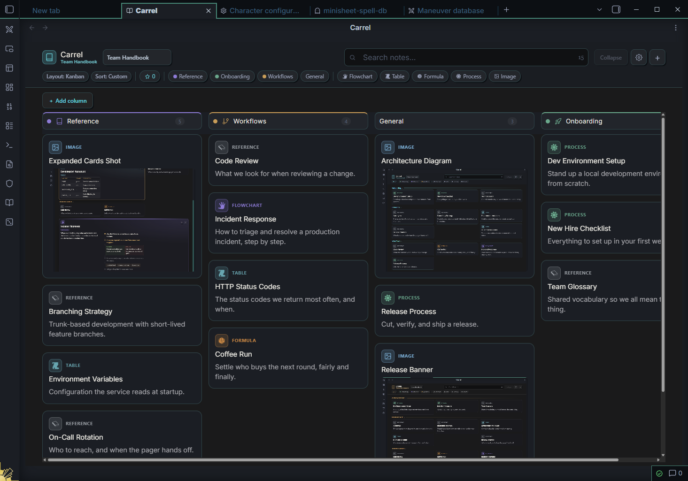
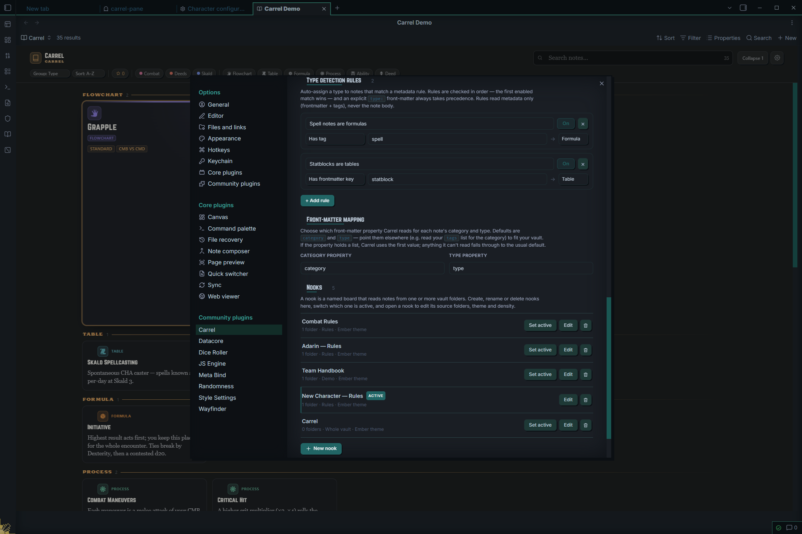
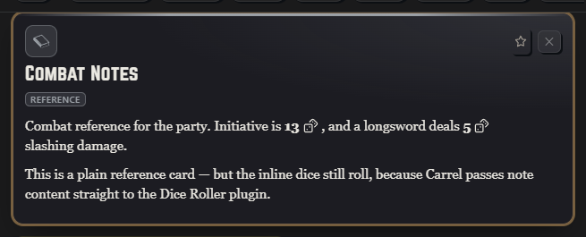
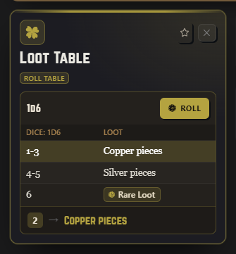
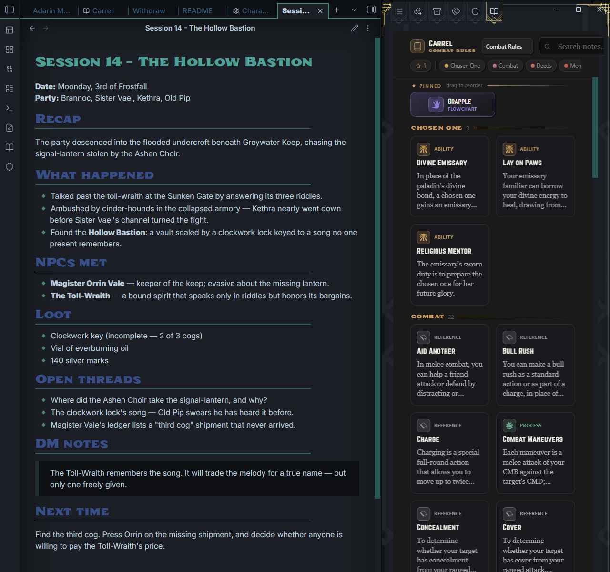

# Carrel

A novel way to view, sort, and study any set of notes — as a column-balancing board of typed reference cards. Carrel turns a folder (or several) of vault notes into a browsable wall of cards you can pin, filter, search, and expand to read in place, without leaving the board.


Carrel works as a full workspace pane, as an inline embed you can drop into any note, and as a custom view for [Obsidian Bases](https://help.obsidian.md/bases). It started as the References tab of the [Wayfinder](https://github.com/alas-poor-ophelia) character sheet and now runs on its own — when both are installed, the two integrate.

---

## Installation

### From the Community Plugins browser

1. Open **Settings → Community plugins**.
2. Turn off **Restricted mode** if it is on.
3. Click **Browse**, search for **Carrel**, and click **Install**.
4. Click **Enable**.

### From BRAT (beta releases)

[BRAT](https://github.com/TfTHacker/obsidian42-brat) (the Beta Reviewers Auto-update Tool) installs and updates pre-release builds ahead of the stable Community Plugins listing.

1. Install **BRAT** from the Community Plugins browser and enable it.
2. Open the command palette and run **BRAT: Add a beta plugin for testing**.
3. Enter the repository: `alas-poor-ophelia/carrel`
4. BRAT downloads the latest release and installs Carrel. Enable it under **Settings → Community plugins**.
5. To update later, run **BRAT: Check for updates to all beta plugins**.

### Manual

Download `main.js`, `styles.css`, and `manifest.json` from the [latest release](https://github.com/alas-poor-ophelia/carrel/releases), and copy them into `<your-vault>/.obsidian/plugins/carrel/`. Reload Obsidian and enable Carrel.

---

## Quick start

1. Enable Carrel. A **book** icon appears in the left ribbon — click it (or run **Carrel: Open Carrel pane**) to open the board.
2. Run **Carrel: Create nook from folders** and pick one or more folders. A *nook* is a named board built from those folders' notes.
3. Open the board. Every note becomes a card. Click a card to expand and read it in place; click the **star** to pin it to the rail at the top.
4. (Optional) Tag a note with `category: <name>` in its front matter, then create that category under **Settings → Carrel** to give it a color and icon.

That's the whole loop: point a nook at some folders, then browse, pin, filter, and read.

---

## How it works

### Nooks — named boards over folders

A **nook** is a saved board that reads from one or more vault folders. You can keep several — "Combat rules", "Lore", "Project specs" — each with its own source folders, theme, and display settings. Switching nooks (or setting one active) changes what the pane shows. Your notes are never moved or modified; a nook is just a lens over them.

### Cards and the column-balancing board

Each note is rendered as a **card**. Closed, a card shows its icon, type badge, title, and a one-line summary. The board lays cards out as a **column-balancing masonry** — it fits as many columns as your pane is wide (roughly one per 330px) and drops each card into the shortest column so the wall stays even instead of leaving ragged gaps.

Click a card to **expand** it in place. The full note renders inline (wikilinks, embeds, and markdown all work), and the card claims **one to three columns** depending on how much content it holds — a one-line note stays narrow; a multi-paragraph entry with a table widens out and flows into reading-width text columns. Opening a card slides its neighbors out of the way; you can have any number open at once and clear them all with **Collapse**. (Prefer your categories laid out as columns instead of a balanced wall? Switch the nook to the [Kanban layout](#kanban-layout).)


### Typed cards

Every card has a **type** that sets its icon, accent color, and how its content renders when expanded. Most types are inferred from the note's structure — write normal Markdown and Carrel recognizes a table, a checklist, a flowchart, and so on. Type badges double as filter chips. See [Card types](#card-types) below for the full list and how to structure each kind of content.

### Categories

Where types are inferred, **categories** are yours to define. A note joins a category by declaring it in front matter:

```yaml
---
category: Deed
---
```

Under **Settings → Carrel** you give each category a name, a color (from a curated palette or a custom picker), and an icon (from Obsidian's built-in Lucide set, or RPG Awesome when Wayfinder is installed). Categories drive card tinting, the category section headers on the board, and the category filter chips. Drag the grip to reorder them. Deleting a category leaves your notes' front matter intact — it just stops styling them.

### Pinning and the rail

Click the **star** on any card to pin it. Pinned cards collect in a horizontal **rail** at the top of the board. Grab a card's grip and drag to reorder the rail; the order is saved per nook. A pin filter chip (★) lets you show only pinned cards.

### Search and filters

A fuzzy **search** box matches across title, category, summary, and body — type `aoc` and it finds "Aura of Courage", highlighting the matched letters. While searching, the board collapses into a single ranked results section.

Below the search box, **filter chips** narrow the wall: the pin filter, one chip per category, and one per content type. Selecting several categories (or several types) shows cards matching *any* of them. Chips only appear for categories and types that actually exist in the current nook.

### Keyboard navigation

The board is fully keyboard-drivable:

| Key | Action |
| --- | --- |
| `/` | Focus the search box |
| `↑ ↓ ← →` | Move the focus ring between cards (by position, not list order) |
| `Enter` / `Space` | Expand or collapse the focused card |
| `Esc` | Close the focused card, then all open cards, then clear focus |

---

## Kanban layout

Every nook can switch from the masonry **Board** to a **Kanban** layout — choose it from the **Layout** dropdown on the toolbar (the choice is saved per nook). Instead of a balanced wall, your categories become **columns** (swimlanes) laid out left to right, with each card sitting under its category.



**Curating the columns.** The columns are yours to choose, with the **＋ Add column** button. Its menu lists every category your notes already use and every category you've defined in Settings — plus a **New category…** entry to spin up a brand-new swimlane on the spot. Remove a column with the **×** on its header; the notes are untouched, they just stop showing until you add the column back.

**Drag to recategorize.** Drag a card from one column to another and Carrel writes the new category into the note's front matter — so the move sticks to the note, not just the board. Drop a card into a new, empty column and that category is written onto it. Drag within a column to reorder (saved per nook). Dragging toward a column that's scrolled off-screen auto-scrolls the board to bring it into reach.

**Expanding across columns.** Open a card and it expands *sideways*, spanning as many columns as its content needs and flowing the neighbouring swimlanes' cards down to make room — then snapping them back when you collapse it.

**Scrolling.** A wide board scrolls horizontally — spin the wheel over the column headers, drag the header row, or use the scrollbar — while the columns scroll vertically. Column width is adjustable through [Style Settings](https://github.com/mgmeyers/obsidian-style-settings) (Carrel → Kanban column width).

Kanban reads and writes the same `category` property as the rest of Carrel, so a card's column always reflects its note. In a [Bases](#bases-view) view, cards can be reordered but not moved between columns — a category write could drop them from the Base's filter.

---

## Card types

Most card types are **inferred** from a note's structure — you write ordinary Markdown and Carrel recognizes it. A few are **declared** explicitly in front matter.

### Declaring a type (optional)

Set `type:` in front matter to force a card's type, regardless of its content:

```yaml
---
type: ability
---
```

The full set is `ability`, `deed`, `trait`, `flowchart`, `table`, `formula`, `process`, `lore`, `image`, and `reference`. The first three plus `lore` carry Carrel's character-sheet heritage — handy for RPG and worldbuilding vaults — but any vault can use them. The rest are usually left to inference (or, for `image`, to a cover property — see [Image cards](#image-cards)).

### How a type is inferred

When you don't declare one, Carrel chooses a type from the note's blocks, in this order:

| Type | Inferred when the note… |
| --- | --- |
| **Flowchart** | contains a `ref-flow` block |
| **Formula** | contains a dice block |
| **Image** | is mostly a picture — one or more image embeds and little other text |
| **Lore** | opens with a blockquote (callout) |
| **Process** | contains a checklist or a numbered list |
| **Table** | contains tables, and at least as many tables as prose paragraphs |
| **Reference** | none of the above — the neutral fallback |

### Image cards

A note that's **mostly a picture** — an image embed or two with little other text — renders as an **image card**: a cover-cropped thumbnail when collapsed, and the full image, bounds-contained, when expanded. Handy for maps, character art, reference shots, and mood boards.

You can also give any note a **cover image** with a front-matter property, which forces an image card and supplies the thumbnail even when the note has other content:

```yaml
---
image: "[[ser-aldric.png]]"
---
```

The property defaults to `image`, and its name is configurable (Settings → Carrel). It accepts an embed (`![[pic.png]]`), a wikilink (`[[pic.png]]`), a bare path or filename, or an external URL — and it doubles as the cover mapping for [Bases](#bases-view) views, so a Base of notes with cover images renders as a wall of image cards.

### Typed blocks

Inside a note, certain Markdown shapes render as rich blocks when the card is expanded. Write them as ordinary Markdown.

**Table** — a standard Markdown table:

```markdown
| Code | Meaning |
| --- | --- |
| 200 | OK |
| 404 | Not Found |
```

**Checklist** — task-list items. They render as checkboxes you can toggle, and their state is saved per nook:

```markdown
- [ ] Scout the area
- [x] Set up camp
```

**Steps** — a numbered list, rendered as ordered steps:

```markdown
1. Freeze the release branch.
2. Run the test suite.
3. Deploy behind a flag.
```

**Bullets** — a normal bullet list. Lead an item with `**Term** — text` to render a term/definition pair:

```markdown
- **Correctness** — does it handle the edge cases?
- **Tests** — is the new behavior covered?
```

**Callout** — a blockquote. A trailing `— attribution` line becomes a citation:

```markdown
> The mountain gives warmth, and takes its due.
> — The first oath
```

**Obsidian callouts & infoboxes** — an Obsidian [callout](https://help.obsidian.md/callouts) (`> [!type]`), including the worldbuilding **infobox** pattern, renders through Obsidian's own pipeline, so the native callout chrome plus any embedded images, headings, and tables inside it all resolve:

```markdown
> [!infobox|left]
> # Ser Aldric
> ![[aldric.png|cover]]
> | Trait | Value |
> | --- | --- |
> | Class | Paladin |
> | Level | 7 |
```

**Flowchart** — a fenced `ref-flow` block written in a small step language:

````markdown
```ref-flow
start: An alert fires.
check: Can you confirm customer impact?
branch:
  success: Declare an incident and page the lead.
  fail: Log it, watch five minutes, and close if quiet.
note: Assign roles before debugging.
options: Incident lead | Communications | Operations
```
````

The keys are `start`, `note`, `check`, `branch` (followed by indented `success:` / `fail:` lines), and `options` (a `|`-separated list).

**Dice** — a one-line HTML comment that renders an interactive roll widget:

```markdown
<!-- block: dice expr:"2d6" mod:"3" label:"Damage" -->
```

`expr` is the dice expression (default `1d20`), `mod` an optional flat modifier, and `label` the caption.

> **Tip:** any block can be forced to a specific type with a leading `<!-- block: <type> … -->` comment — for example `<!-- block: table caption:"Reach by weapon" -->` adds a caption to the table that follows.

---

## Customizing types — disable and detect

The built-in types and their inference fit most vaults, but **Settings → Carrel → Types** adds two levers for the rest:

- **Disable a built-in type.** Toggle off any type you don't use. Carrel stops *inferring* it — those notes fall through to the next match — and its filter chip and type section disappear. Notes that *declare* the type in front matter keep it.
- **Type detection rules.** Auto-assign a type to notes that match a metadata rule, without parsing the note body. Each rule maps a condition to a target type, checked in order — the first enabled match wins:
  - **Has frontmatter key** — the note has a given property (any value).
  - **Frontmatter key equals** — a property equals a given value.
  - **Has tag** — the note carries a given tag.

So "notes tagged `#spell` are **Formula**" or "notes with a `statblock` property are **Table**." An explicit `type:` in front matter still wins over a rule; rules only fill in where you'd otherwise rely on inference.



---

## Embedding Carrel in a note

Besides the full-width pane, Carrel can render a board **inline inside any note** — a more compact view meant to live alongside your writing. Add a `carrel` code block naming the nook:

````markdown
```carrel
nook: Team Handbook
```
````

The fastest way is the **Carrel: Insert Carrel block** command, which lets you pick a nook (or create one on the spot) and writes the block for you.


An inline embed is deliberately different from the full pane:

- It shows the **pinned rail and cards only** — no toolbar, search box, or filter chips.
- It sits at the **note's width** and is **capped at a height** (set in Style Settings), scrolling within itself.
- It runs its **own index**, so it always shows the nook you named — independent of whichever nook is active in the pane.

It still updates live as the underlying notes change, and you can expand cards and follow links right inside the note.

---

## Bases view

[Obsidian Bases](https://help.obsidian.md/bases) (Obsidian 1.10+) turns a set of notes into a filtered, queryable view. Carrel registers a **"Carrel" view type** for any `.base` file: switch a Base to the Carrel view and its filtered results render as the full Carrel board — real types, flowcharts, colors, and your type rules, all of it. Each note is parsed exactly as it is in a nook, so a flowchart note is a flowchart and a table is a table.


To use it, open a `.base` file, add or open a view, and choose **Carrel** as the view type. The board updates live as you change the Base's filters and formulas or edit the underlying notes. Each Carrel Bases view keeps its own grouping, sort, and pins (stored with the view), and the usual board controls — search, filter chips, density, theme — are on its toolbar.

Carrel renders the *notes'* content here, not the Base's columns, so reach for it when you want to **read** a filtered slice of your vault as cards; use the built-in Table or Cards views when you want the property grid.

---

## Theming

Each nook chooses one of two looks in its settings:

- **Ember** — a dark theme with red/gold accents and the Norwester / Taroca / Crimson Text type treatment. Accent colors and fonts are customizable through the [Style Settings](https://github.com/mgmeyers/obsidian-style-settings) plugin.
- **Obsidian** — inherits your active Obsidian theme's colors and fonts, so the board blends into whatever you already run. (This is the theme shown in the screenshot at the top.)

The same board in the **Ember** theme:


If you have the [Style Settings](https://github.com/mgmeyers/obsidian-style-settings) plugin, a **Carrel** section lets you set the primary (red) and secondary (gold) accents, the display / label / body fonts, and the maximum height of inline embeds.

---

## Dice Roller integration

[Dice Roller](https://github.com/javalent/dice-roller) is the popular TTRPG dice plugin for Obsidian. When it's installed, Carrel hands rolls off to it — so its full grammar (keep/drop, exploding dice, Fate/Fudge, and more), its **lookup tables**, and **nested tables** all work inside your cards. When it isn't installed, plain dice still roll with Carrel's own built-in roller; the table features simply stay quiet.

Because Carrel renders note content through Obsidian's own Markdown pipeline, **any inline `` `dice:` `` expression rolls in place — in any card, not just Formula cards.** Drop a roll into a plain reference note and it just works:



### Roll Table cards

A note whose body is a Dice Roller **lookup table** — a Markdown table whose first header cell is a `dice:` formula — becomes a dedicated **Roll Table** card. Carrel shows the table with a **Roll** button; rolling highlights the matched row and shows the result with the rolled number beside it. A cell that points at another table (a **nested** roll) renders as a tidy reference chip and resolves to a live sub-roll when rolled.



Write one as an ordinary table, with the dice formula in the first header cell and a block-id anchor on the line beneath it (the anchor lets other tables and cards reference it):

```markdown
| dice: 1d6 | Loot |
| --- | --- |
| 1-3 | Copper pieces |
| 4-5 | Silver pieces |
| 6 | `dice: [[Rare Loot^rare]]` |

^loot
```

### Rolling on a table from another card

To roll on a lookup table that lives in a *different* note, add a roll-table block pointing at it. The card gets its own Roll button and shows the result — and the rolled number — each time:

```markdown
<!-- block: rolltable ref:"[[Loot Table^loot]]" label:"Roll for loot" -->
```

---

## Wayfinder integration

Carrel grew out of [Wayfinder](https://github.com/alas-poor-ophelia), a character-sheet plugin. The two work independently, but when Wayfinder is also installed you get a little more:

- The **RPG Awesome** icon set (1000+ themed glyphs) unlocks in the category icon picker, alongside the always-available Lucide set.
- A nook can pick up a linked character's accent colors, so its Ember theme matches the sheet.
- Wayfinder can render a Carrel board in place of its built-in References tab.



None of this is required — Carrel is fully standalone. The integration simply activates when both plugins are present.

---

## Configuration reference

**Categories** (Settings → Carrel)
- Add, edit, reorder (drag), and delete categories.
- Per category: name, color (palette or custom), icon (Lucide / RPG Awesome).

**Nooks** (Settings → Carrel)
- Create a nook from selected folders; set the active nook; edit or delete.
- Per nook: **name**, **theme** (Ember / Obsidian), **source folders**, **density** (Compact / Regular / Comfortable), **pinned rail** on/off, **type badges & meta** on/off, **reflow animation** on/off.

**Style Settings** (if the Style Settings plugin is installed)
- Primary accent (red), secondary accent (gold).
- Display, label, and body fonts.
- Inline embed maximum height (200–1200px).
- Kanban column width (150–460px).

**Commands**
- Carrel: Open Carrel pane
- Carrel: Create nook from folders
- Carrel: Insert Carrel block

---

## Known limitations

- Card **type** is inferred from structure by default. You can disable individual types and add metadata-based detection rules (Settings → Carrel → Types), but the inference itself is heuristic and falls back to a plain Reference card when nothing else matches.
- Open cards, keyboard focus, the search query, and active filters are transient — they reset when the pane reloads. Pins, pin order, and checklist state persist per nook.

---

## Support

Found a bug or have a request? Open an issue at [github.com/alas-poor-ophelia/carrel/issues](https://github.com/alas-poor-ophelia/carrel/issues).

## License

[MIT](LICENSE)
