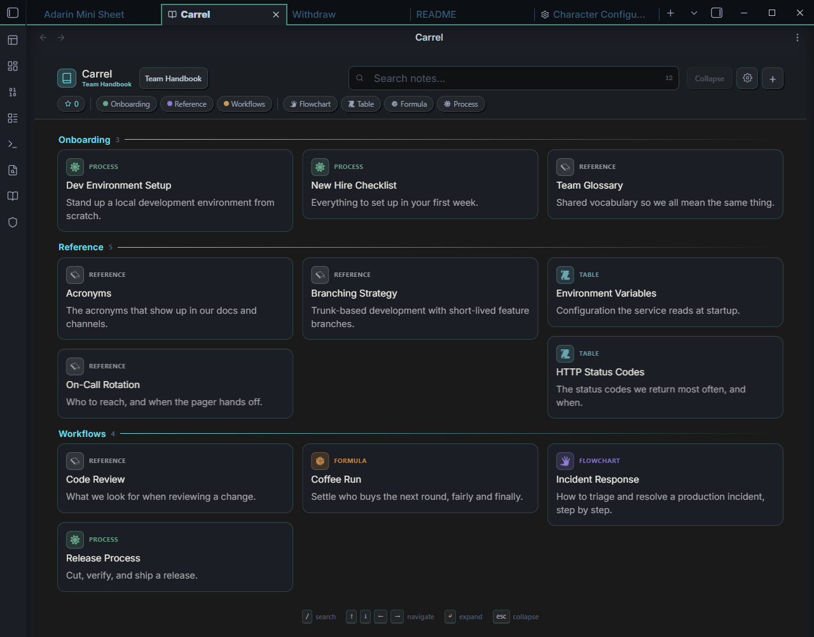
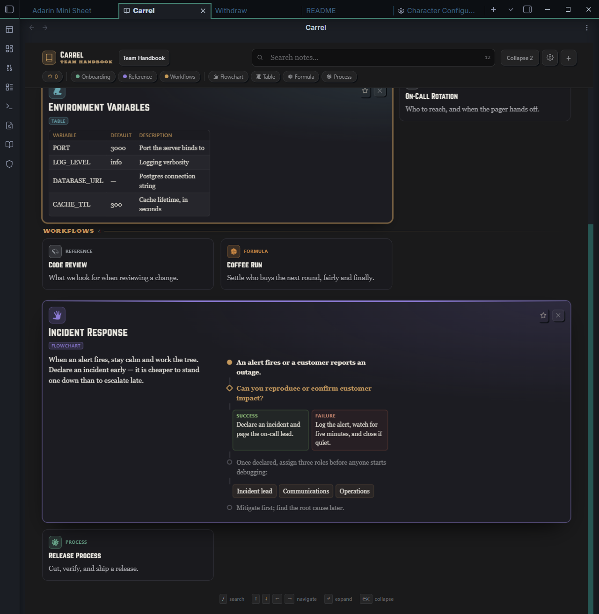
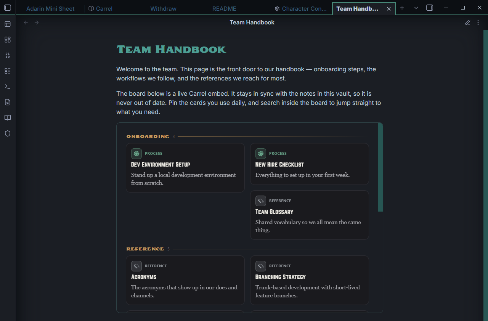
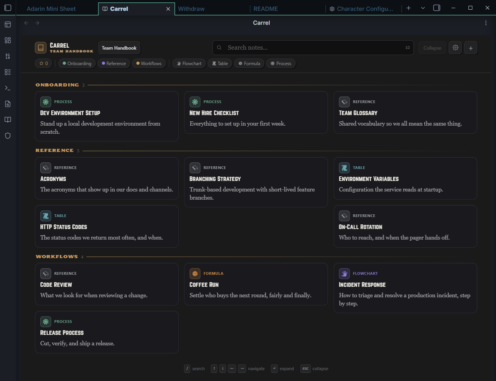
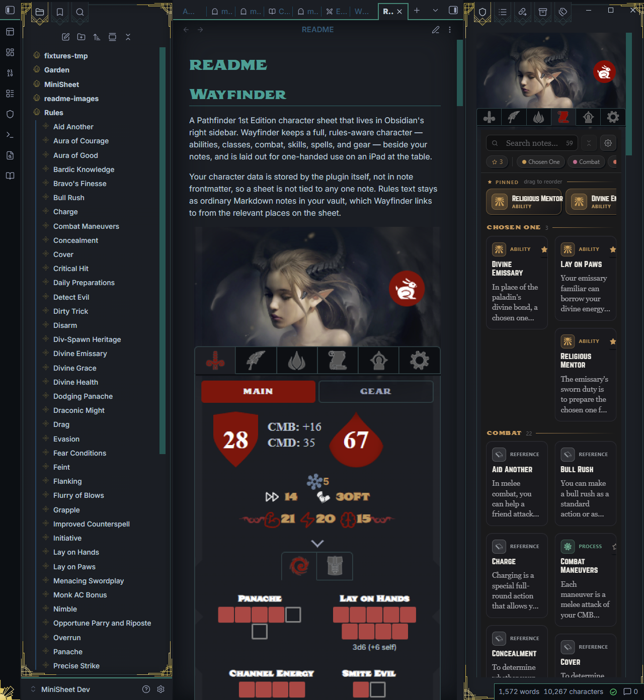

# Carrel

A novel way to view, sort, and study any set of notes — as a column-balancing board of typed reference cards. Carrel turns a folder (or several) of vault notes into a browsable wall of cards you can pin, filter, search, and expand to read in place, without leaving the board.



Carrel works as a full workspace pane and as an inline embed you can drop into any note. It started as the References tab of the [Wayfinder](https://github.com/alas-poor-ophelia) character sheet and now runs on its own — when both are installed, the two integrate.

---

## Installation

### From the Community Plugins browser

> Carrel is not yet in the Community Plugins directory. Once it is listed, these are the steps.

1. Open **Settings → Community plugins**.
2. Turn off **Restricted mode** if it is on.
3. Click **Browse**, search for **Carrel**, and click **Install**.
4. Click **Enable**.

### From BRAT (beta releases)

[BRAT](https://github.com/TfTHacker/obsidian42-brat) (the Beta Reviewers Auto-update Tool) installs and updates plugins that aren't in the directory yet.

1. Install **BRAT** from the Community Plugins browser and enable it.
2. Open the command palette and run **BRAT: Add a beta plugin for testing**.
3. Enter the repository: `alas-poor-ophelia/carrel`
4. BRAT downloads the latest release and installs Carrel. Enable it under **Settings → Community plugins**.
5. To update later, run **BRAT: Check for updates to all beta plugins**.

### Manual

Download `main.js`, `styles.css`, and `manifest.json` from the [latest release](https://github.com/alas-poor-ophelia/carrel/releases), and copy them into `<your-vault>/.obsidian/plugins/carrel/`. Reload Obsidian and enable Carrel.

---

## Quick start

1. Enable Carrel. A **book** icon appears in the left ribbon — click it (or run **Carrel: Open Carrel pane**) to open the board.
2. Run **Carrel: Create nook from folders** and pick one or more folders. A *nook* is a named board built from those folders' notes.
3. Open the board. Every note becomes a card. Click a card to expand and read it in place; click the **star** to pin it to the rail at the top.
4. (Optional) Tag a note with `category: <name>` in its front matter, then create that category under **Settings → Carrel** to give it a color and icon.

That's the whole loop: point a nook at some folders, then browse, pin, filter, and read.

---

## How it works

### Nooks — named boards over folders

A **nook** is a saved board that reads from one or more vault folders. You can keep several — "Combat rules", "Lore", "Project specs" — each with its own source folders, theme, and display settings. Switching nooks (or setting one active) changes what the pane shows. Your notes are never moved or modified; a nook is just a lens over them.

### Cards and the column-balancing board

Each note is rendered as a **card**. Closed, a card shows its icon, type badge, title, and a one-line summary. The board lays cards out as a **column-balancing masonry** — it fits as many columns as your pane is wide (roughly one per 330px) and drops each card into the shortest column so the wall stays even instead of leaving ragged gaps.

Click a card to **expand** it in place. The full note renders inline (wikilinks, embeds, and markdown all work), and the card claims **one to three columns** depending on how much content it holds — a one-line note stays narrow; a multi-paragraph entry with a table widens out and flows into reading-width text columns. Opening a card slides its neighbors out of the way; you can have any number open at once and clear them all with **Collapse**.



### Typed cards

Every card has a **type** that sets its icon, accent color, and how its content renders when expanded. Most types are inferred from the note's structure — write normal Markdown and Carrel recognizes a table, a checklist, a flowchart, and so on. Type badges double as filter chips. See [Card types](#card-types) below for the full list and how to structure each kind of content.

### Categories

Where types are inferred, **categories** are yours to define. A note joins a category by declaring it in front matter:

```yaml
---
category: Deed
---
```

Under **Settings → Carrel** you give each category a name, a color (from a curated palette or a custom picker), and an icon (from Obsidian's built-in Lucide set, or RPG Awesome when Wayfinder is installed). Categories drive card tinting, the category section headers on the board, and the category filter chips. Drag the grip to reorder them. Deleting a category leaves your notes' front matter intact — it just stops styling them.

### Pinning and the rail

Click the **star** on any card to pin it. Pinned cards collect in a horizontal **rail** at the top of the board. Grab a card's grip and drag to reorder the rail; the order is saved per nook. A pin filter chip (★) lets you show only pinned cards.

### Search and filters

A fuzzy **search** box matches across title, category, summary, and body — type `aoc` and it finds "Aura of Courage", highlighting the matched letters. While searching, the board collapses into a single ranked results section.

Below the search box, **filter chips** narrow the wall: the pin filter, one chip per category, and one per content type. Selecting several categories (or several types) shows cards matching *any* of them. Chips only appear for categories and types that actually exist in the current nook.

### Keyboard navigation

The board is fully keyboard-drivable:

| Key | Action |
| --- | --- |
| `/` | Focus the search box |
| `↑ ↓ ← →` | Move the focus ring between cards (by position, not list order) |
| `Enter` / `Space` | Expand or collapse the focused card |
| `Esc` | Close the focused card, then all open cards, then clear focus |

---

## Card types

Most card types are **inferred** from a note's structure — you write ordinary Markdown and Carrel recognizes it. A few are **declared** explicitly in front matter.

### Declaring a type (optional)

Set `type:` in front matter to force a card's type, regardless of its content:

```yaml
---
type: ability
---
```

The full set is `ability`, `deed`, `trait`, `flowchart`, `table`, `formula`, `process`, `lore`, and `reference`. The first three plus `lore` carry Carrel's character-sheet heritage — handy for RPG and worldbuilding vaults — but any vault can use them. The rest are usually left to inference.

### How a type is inferred

When you don't declare one, Carrel chooses a type from the note's blocks, in this order:

| Type | Inferred when the note… |
| --- | --- |
| **Flowchart** | contains a `ref-flow` block |
| **Formula** | contains a dice block |
| **Lore** | opens with a blockquote (callout) |
| **Process** | contains a checklist or a numbered list |
| **Table** | contains tables, and at least as many tables as prose paragraphs |
| **Reference** | none of the above — the neutral fallback |

### Typed blocks

Inside a note, certain Markdown shapes render as rich blocks when the card is expanded. Write them as ordinary Markdown.

**Table** — a standard Markdown table:

```markdown
| Code | Meaning |
| --- | --- |
| 200 | OK |
| 404 | Not Found |
```

**Checklist** — task-list items. They render as checkboxes you can toggle, and their state is saved per nook:

```markdown
- [ ] Scout the area
- [x] Set up camp
```

**Steps** — a numbered list, rendered as ordered steps:

```markdown
1. Freeze the release branch.
2. Run the test suite.
3. Deploy behind a flag.
```

**Bullets** — a normal bullet list. Lead an item with `**Term** — text` to render a term/definition pair:

```markdown
- **Correctness** — does it handle the edge cases?
- **Tests** — is the new behavior covered?
```

**Callout** — a blockquote. A trailing `— attribution` line becomes a citation:

```markdown
> The mountain gives warmth, and takes its due.
> — The first oath
```

**Flowchart** — a fenced `ref-flow` block written in a small step language:

````markdown
```ref-flow
start: An alert fires.
check: Can you confirm customer impact?
branch:
  success: Declare an incident and page the lead.
  fail: Log it, watch five minutes, and close if quiet.
note: Assign roles before debugging.
options: Incident lead | Communications | Operations
```
````

The keys are `start`, `note`, `check`, `branch` (followed by indented `success:` / `fail:` lines), and `options` (a `|`-separated list).

**Dice** — a one-line HTML comment that renders an interactive roll widget:

```markdown
<!-- block: dice expr:"2d6" mod:"3" label:"Damage" -->
```

`expr` is the dice expression (default `1d20`), `mod` an optional flat modifier, and `label` the caption.

> **Tip:** any block can be forced to a specific type with a leading `<!-- block: <type> … -->` comment — for example `<!-- block: table caption:"Reach by weapon" -->` adds a caption to the table that follows.

---

## Embedding Carrel in a note

Besides the full-width pane, Carrel can render a board **inline inside any note** — a more compact view meant to live alongside your writing. Add a `carrel` code block naming the nook:

````markdown
```carrel
nook: Team Handbook
```
````

The fastest way is the **Carrel: Insert Carrel block** command, which lets you pick a nook (or create one on the spot) and writes the block for you.



An inline embed is deliberately different from the full pane:

- It shows the **pinned rail and cards only** — no toolbar, search box, or filter chips.
- It sits at the **note's width** and is **capped at a height** (set in Style Settings), scrolling within itself.
- It runs its **own index**, so it always shows the nook you named — independent of whichever nook is active in the pane.

It still updates live as the underlying notes change, and you can expand cards and follow links right inside the note.

---

## Theming

Each nook chooses one of two looks in its settings:

- **Ember** — a dark theme with red/gold accents and the Norwester / Taroca / Crimson Text type treatment. Accent colors and fonts are customizable through the [Style Settings](https://github.com/mgmeyers/obsidian-style-settings) plugin.
- **Obsidian** — inherits your active Obsidian theme's colors and fonts, so the board blends into whatever you already run. (This is the theme shown in the screenshot at the top.)

The same board in the **Ember** theme:



If you have the [Style Settings](https://github.com/mgmeyers/obsidian-style-settings) plugin, a **Carrel** section lets you set the primary (red) and secondary (gold) accents, the display / label / body fonts, and the maximum height of inline embeds.

---

## Wayfinder integration

Carrel grew out of [Wayfinder](https://github.com/alas-poor-ophelia), a character-sheet plugin. The two work independently, but when Wayfinder is also installed you get a little more:

- The **RPG Awesome** icon set (1000+ themed glyphs) unlocks in the category icon picker, alongside the always-available Lucide set.
- A nook can pick up a linked character's accent colors, so its Ember theme matches the sheet.
- Wayfinder can render a Carrel board in place of its built-in References tab.



None of this is required — Carrel is fully standalone. The integration simply activates when both plugins are present.

---

## Configuration reference

**Categories** (Settings → Carrel)
- Add, edit, reorder (drag), and delete categories.
- Per category: name, color (palette or custom), icon (Lucide / RPG Awesome).

**Nooks** (Settings → Carrel)
- Create a nook from selected folders; set the active nook; edit or delete.
- Per nook: **name**, **theme** (Ember / Obsidian), **source folders**, **density** (Compact / Regular / Comfortable), **pinned rail** on/off, **type badges & meta** on/off, **reflow animation** on/off.

**Style Settings** (if the Style Settings plugin is installed)
- Primary accent (red), secondary accent (gold).
- Display, label, and body fonts.
- Inline embed maximum height (200–1200px).

**Commands**
- Carrel: Open Carrel pane
- Carrel: Create nook from folders
- Carrel: Insert Carrel block

---

## Known limitations

- Not yet published in the Community Plugins directory — install via BRAT or manually for now.
- Card **type** is inferred, not user-assigned; the inference is heuristic and falls back to a plain Reference card when it can't tell.
- Open cards, keyboard focus, the search query, and active filters are transient — they reset when the pane reloads. Pins, pin order, and checklist state persist per nook.

---

## Support

Found a bug or have a request? Open an issue at [github.com/alas-poor-ophelia/carrel/issues](https://github.com/alas-poor-ophelia/carrel/issues).

## License

[MIT](LICENSE)
